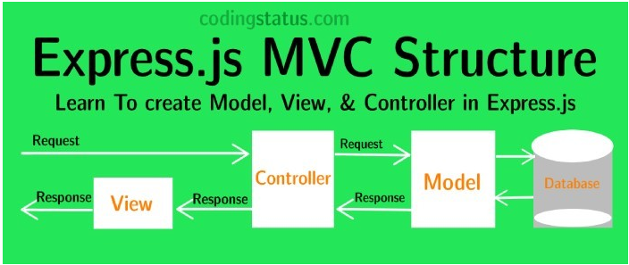
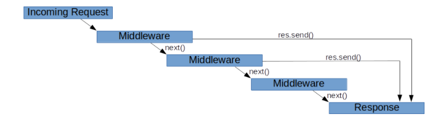
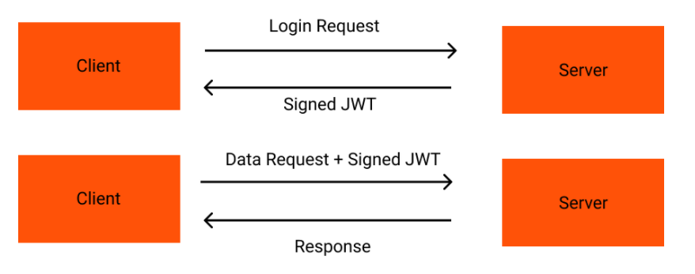

# learn-express
  

使用MVC的结构，然后在Controller层利用各种**中间件**  


## environment variables
- dotenv：调用.env文件中的变量
- envalid：检查.env文件中的变量

## mongoose
```
// Everything in Mongoose starts with a Schema. 
// Each schema maps to a MongoDB collection and defines the shape of the documents within that collection.
const postSchema = new mongoose.Schema({
    author: String,
    content: String,
    title: String,
});

const postModel = mongoose.model<Post & mongoose.Document>('Post', postSchema);
```
## CURD
```
const createdPost = new postModel(postData);
createdPost.save()
```
- postModel.find()
- postModel.findById(req.params.id)
- postModel.findByIdAndUpdate(id, postData, { new: true })
- postModel.findByIdAndDelete(id)

### Express Error handling middleware
```
errorHandler(err, req, res, next)
```  

> 错误处理的中间件的差别主要是第一个参数是错误信息，同时要在其他 app.use() 和路由调用之后，最后定义错误处理中间件。
> 如果将任何项传递到 next() 函数（除了字符串 'route'），那么 Express 会将当前请求视为处于错误状态，并跳过所有剩余的非错误处理路由和中间件函数。

## 使用class-validator和class-transformer来验证数据
### class-validator
设置数据类型
```
@IsString()
public title!: string;
```
- validate：验证传入的数据
- ValidationError：validate验证后的关于错误的对象
- skipMissingProperties：部分更新功能

### class-transformer
- plainToClass: This method transforms a plain javascript object to instance of specific class.  

## Hash
从安全角度出发，使用Hash保存密码防止密码泄露时人家直接看到了明文

## Bcrypt
use a bcrypt hashing algorithm implemented   

- bcrypt.hash：进行hash加密，第一个参数是加密对象，第二个值是 salt值(控制加密的强度)
- bcrypt.compare：进行hash值之间的比较，判断是否相等

## JWT
  

> JWT(JSON Web Tokens) is a piece of JSON data that is signed on our server using a secret key when the user is logged in and then sent to him in. When he makes other requests, he sends this token in the headers so that we can encode it back using the same secret key. If the token is valid, we know who the user that made the request is.  

### 使用jsonwebtoken包来设置jwt
- jwt.sign：设置获取token
- 通过response把token信息带回客户端

```
response.setHeader('Set-Cookie', [`Authorization=${tokenData.token}; HttpOnly; Max-Age=${tokenData.expiresIn}`);
```
- 利用cookie-parser获取请求头中的cookie信息
- jwt.verify(cookies.Authorization, secret)解析token信息